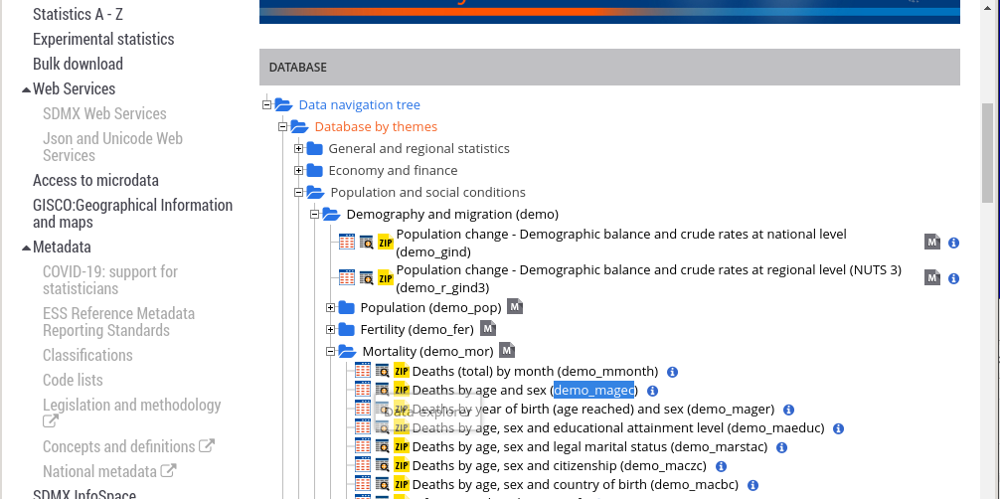
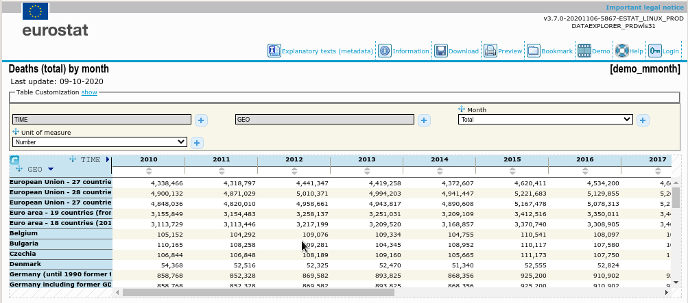
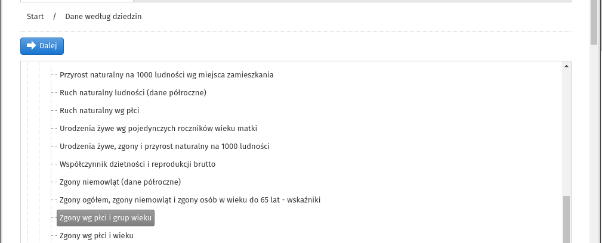
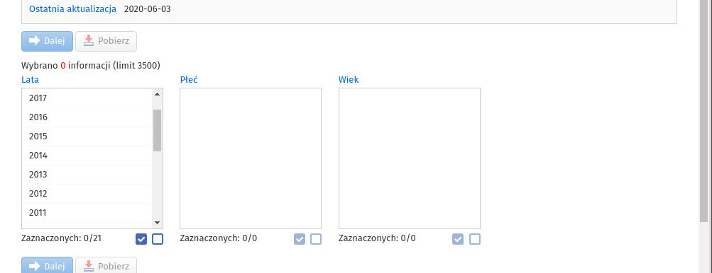
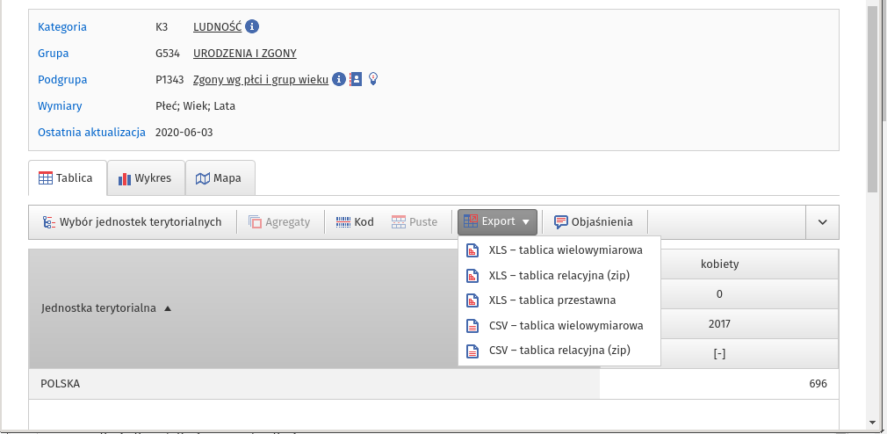

## Wstęp

W założeniu przegląd ważniejszych pojęć używanych w Demografii
w nawiązaniu do danych dostępnych z publicznych repozytoriów typu
GUS, EUROSTAT, WHO czy FAO. 

## Pomiar

Spis powszechny (**national census**), rejestry (**register** USC, PESEL),
badanie (survey)

Spis/rejestr: wszyscy są liczeni. Badania zwykle są cząstkowe (inaczej by
się nazywały jeżeli by nie były :-)).
Spis co 10 (lub co 5) lat. Sposób zliczania: *de facto*
(miejsce aktualnego pobytu)
albo *de jure* (miejsce stałego zamieszkania).

Pierwsze spisy: 3000 lat BC (Chiny) albo Cesarstwo Rzymskie (5 wiek BC;
spis jest wspomniany w Bibliii,
na spis jechała św Rodzina
przed urodzeniem Jezusa -- Ewangelia wg św Łukasza,
cf https://pl.wikipedia.org/wiki/Ewangelia_%C5%81ukasza)

Pierwszy spis w Polsce
https://pl.wikipedia.org/wiki/Pierwszy_Powszechny_Spis_Ludno%C5%9Bci
Historia spisów na ziemiach Polskich
https://spis.gov.pl/o-spisie/historia-spisow

W USA pierwszy spis w 1790 roku w podziale na następujące
kategorie: biali mężczyźni pełnoletni (16 lat i więcej),
biali mężczyźni nieletni, białe kobiety, niewolnicy, inni [BP2010]

Rejestry: USC/PESEL. Akt urodzenia/zgonu/zawarcia małżeństwa. Teoretycznie
precyzyjne (albo wiarygodne
czyli w języku **reliable**), ale różnie to bywa...

**Rate** vs **ratio**: czyli iloraz czegoś
przez coś (jeżeli obie wielkości mają tę samą miarę to będzie **ratio**, a jak \różną to **rate**). W PL nie rozróżnia się ratio/rate -- oba
ilorazy są nazywane po prostu **współczynnik**. 

```{r, echo=F, message=F, warning=F}
library("ggplot2")
library("dplyr")
library("scales")
library("ggthemes")
library("ggpubr")
library("tidyr")
library("ggforce")
library("tidyverse")

spanV <- 0.5
theme_update(legend.title=element_text(family="sans", size=8), legend.position="top" )
```

### TERYT i TERC

TERYT – Krajowy Rejestr Urzędowy Podziału Terytorialnego Kraju – jest to urzędowy rejestr prowadzony przez GUS. W skład TERYT  wchodzi m.in  system identyfikatorów i nazw jednostek podziału terytorialnego – TERC

**Identyfikator TERC** składa się z siedmiu cyfr: wwppggr (województwo/powiat/gmina/symbol jednostki)
**Symbol jednostki**: 1 – gmina miejska, 2 – gmina wiejska,
3 – gmina miejsko-wiejska, 4 – miasto w gminie miejsko-wiejskiej,
5 – obszar wiejski w gminie miejsko-wiejskiej,
8 – dzielnice m. st. Warszawy,
9 – delegatury w miastach: Kraków, Łódź, Poznań i Wrocław.

Konkretnie jak numer TERC wygląda może być różnie: są numery bez symbolu jednostki na przykład.
GUS stosuje konwencje używania 7-cyfrowych numerów TERC z końcowymi zerami: 
2200000 -- pomorskie; 2201000 -- powiat bytowski;
2201023 -- Bytów (gmina mw); 2201024 -- Bytów (miasto); 2201025 -- Bytów (wieś)

Przykład: plik `miasta_wojewodzkie.csv` zawiera m.in. kody TERC 
miast wojewódzkich (w kolumnie `teryt`):

```{r}
wojmiasta <- read.csv("miasta_wojewodzkie.csv", sep = ';', 
                      colClasses=c('factor', 'character', rep('numeric', 2)),
                      header=T, na.string="NA" )
#wojmiasta
wojmiasta$teryt <- sprintf ("%s000", wojmiasta$teryt)
wmt <- wojmiasta$teryt
```


## Płodność (*Fertility*) 

Urodzenia -- liczone są tylko urodzenia żywa; Liczone są także
kolejne numery urodzenia, wiek matek i inne...

Współczynnik rodności (**współczynnik urodzeń** albo *crude birth rate*):
$U/L$, gdzie $L$ to liczba urodzeń żywych;
$L$ to średnia liczba ludności lub stan w połowie roku. Zwykle wynik
jest mnożony przez tysiąc.
Na każde tysiąc ludności rodzi się ileś tam dzieci...

Współczynnik płodności (*general fertility rate*): liczba urodzeń do liczby
kobiet w wieku 15--49 lat (okres płodności). Może być liczony
w grupach wiekowych (cząstkowy albo *age specific fertility rate*)

Dzietność *total fertility rate*: przeciętna liczba dzieci jaką
urodzi kobieta w ciągu swojego
życia. Szacowany na podstawie współczynników płodności.
W zasadzie to samo co WP. Są nawet uproszczone formuły:
$T_{Fr} = G_{Fr} * 30$ (30 to okres 15--49 w latach) albo
$T_{Fr} = C_{Br} * 30 * 4.5$.
Pierwsza z formuł jest prawie dokładna.

Współczynnik dzietności gwarantujący prostą zastępowalność pokoleń to
2,1--2,15

```{r}
# TFR w bazie Eurostatu jest w tabeli demo_find
f <- read.csv("demo_find.csv", sep = ';',  header=T, na.string="NA" )
countries <- c ('PL', 'DE', 'FR', 'UK', 'IT')

f <- f %>% filter ( geo %in% countries & item == 'TOTFERRT')  %>% as.data.frame()

p1 <- ggplot(f, aes(x=year, y=value, color=geo)) +
 geom_smooth(method="loess", se=F, span=spanV, size=.4) +
 geom_point(size=.8, alpha=.5)
p1
```

TFR znajduje się też w bazie FAO (więcej krajów ale dane tylko dla jednego roku):

```
# Pobranie danych via API ze strony WHO
curl "https://apps.who.int/gho/athena/api/GHO/WHS9_95?format=csv" > fertility_who.csv
wc -l fertility_who.csv
184
```

Oryginalny plik `fertility_who.csv` nieco zmodyfikowano usuwając nieptrzebne kolumny.
Ostatecznie plik ten zawiera następujące zmienne: 
`year` (zawsze 2016) `region` (region świata) `geo` (kraj/kod ISO) `aprox_value` (wartość
przybliżona) oraz `value` (wartość dokładna).

```{r}
fw <- read.csv("fertility_who.csv", sep = ';',  header=T, na.string="NA" )
summary(fw$value)
## wg regionów
## AFR=Africa; AMR=Americas; EMR=Eastern Mediterranean; 
## EUR=Europe; SEAR=South-East Asia; WPR=Western Pacific
ggplot(fw, aes(x=region, y=value, fill=region)) + geom_boxplot() + 
  ylab("regiony") + 
  xlab("")
```

Pobierzmy teraz dane dotyczące liczby ludności w poszczególnych krajach świata

```{r}
# curl "https://apps.who.int/gho/athena/api/GHO/WHS9_86?format=csv" > pop_who.csv
pw <- read.csv("pop_who.csv", sep = ';',  header=T, na.string="NA" )

# geo != '' usuwa sumy dla regionów i ogółem zostają tylko kraje
pw <- pw %>% select(geo, value) %>%  filter (geo != '') %>% as.data.frame()
# łącznie na świecie
ludnosc.swiata <- sum(pw$value)

# łączymy obie tabele w oparciu o kolumnę geo
fw <- left_join(fw, pw, by='geo')
# tylko kraje o liczbie ludności > 10mln
fw <- fw %>% filter(value.y > 10000)
duze.kraje <- nrow(fw)
duze.kraje.ludnosc <- sum(fw$value.y)
```

Ludność świata wg WHO to `r ludnosc.swiata` (ale dane nieco stare bo z 2016 roku.)
W dużych krajach (liczba ludności większa do 10mln), którychjest `r duze.kraje`,
mieszka `r duze.kraje.ludnosc`
(czyli `r sprintf ("%.2f%%",  duze.kraje.ludnosc/ludnosc.swiata * 100)`).

Te nawiększe kraje przedstawmy na wykresie punktowym:

```{r}
fr2016p <- ggplot(fw, aes(x = reorder(geo, value.x), color=region )) +
  geom_point(aes(y = value.x), size=1) +
  xlab(label="kraj") +
  ylab(label="wsp. dzietności") +
  ggtitle("Wsp dzietności 2016 wg krajów świata") +
  theme(axis.text = element_text(size = 4)) +
  theme(plot.title = element_text(hjust = 0.5)) +
  coord_flip(ylim = c(0, 8))
fr2016p
```


## Umieralność (*Mortality*)

Zgony -- *permanent, irreversible cessation of all biological functions
that sustain a living organism*. Dla statystyka potwierdzone urzędowo
(Akt zgonu). Żeby umrzeć trzeba się urodzić BTW (zgony dotyczą urodzeń żywych)

Współczynnik zgonów (**crude death rate**): $Z/L$ (liczba zgonów podzielona
przez średnią liczbę ludności w roku lub stan)
Może być liczony w wybranych grupach (wiekowych, zawodowych, płeć)
wtedy nazywa się cząstkowy (albo ASDR **age-specific
death rate**).

W Polsce używa się pojęcia: **współczynnik zgonów w grupie osób w
wieku x ukończonych lat** (jeżeli liczony dla lat; jeżeli dla
przedziałów lat to x--y ukończonych lat)

Zgony niemowląt traktuje się inaczej: $Z/U$ (zgony do urodzeń żywych.)
Może być/jest używany jako miara poziomu rozwoju społeczno-ekonomicznego.

```{r}
z <- read.csv("demo_mmonth.csv", sep = ';',  header=T, na.string="NA" )
countries <- c ('PL', 'DE', 'FR', 'UK', 'IT')

z <- z %>% filter ( geo %in% countries & year > 2000 
                     & (month != 'TOTAL' & month != 'UNK') )  %>% as.data.frame()
z$date <- sprintf ("%i-%02i-01", z$year, as.numeric(substr(z$month,2,3)))

p1 <- ggplot(z, aes(x=as.Date(date), y=value, color=geo)) +
  geom_line(size=.4, alpha=.3) +
  geom_point(size=.8, alpha=.5)
p1
```

Ostatnie pięć lat dla DE/PL/UK:

```{r}
##
z15 <- z %>% filter ( geo %in% c('DE', 'PL', 'UK') & year > 2014 )
z15$date <- sprintf ("%i-%02i-01", z15$year, as.numeric(substr(z15$month,2,3)))

p1 <- ggplot(z15, aes(x=as.Date(date), y=value, color=geo)) +
  geom_line(size=.4, alpha=.3) +
  geom_point(size=.8, alpha=.5)
p1
```


Tablice trwania życia (tablice wymieralności albo *tables*),
to zbiór współczynników
opisujących **proces wymierania** jakiejś populacji.

* współczynniki zgonów w grupach wiekowych (age specific death rate
(Mx albo DEATHRATE wg Eurostatu))

* prawdopodobieństwo zgonu w ciągu roku dla osoby w wieku x lat
(Probability of dying between exact ages (qx albo PROBDEATH))

* prawdopodobieństwo przeżycia w ciągu roku dla osoby w wieku x lat
(Probability of surviving between exact ages (px albo PROBSURV))

* liczba osób dożywających x ukończonych lat
(Number left alive at given exact age (lx albo SURVIVORS))

* liczba zmarłych w ciągu roku (czyli takich, którzy ukończyli x lat)
(Number dying between exact ages (dx albo NUMBERDYING wg Eurostatu,
ale tego współczynnika EuroStat nie publikuje))

* łączna liczba osobo-lat dożywających wieku x lat
(Person-years lived between exact age (Lx albo PYLIVED))

* łączna liczba osobo-lat do przeżycia przez osoby w wieku x lat
(Total person-years lived above given exact age (Tx albo TOTPYLIVED))

* przeciętne dalsze trwanie życia przez osobę wieku x lat (Life
expectancy at given exact age (ex albo LIFEXP))

Przyrost naturalny (*natural change*): różnica pomiędzy liczbą urodzeń a zgonów w roku. Miara
mianowana. Dla porównań **współczynnik przyrostu naturalnego** albo *natural change rate* 
(PN podzielony orzez średnią liczbę ludności)

## Zgony wg przyczyn

Kontrowersyjna bo uznaniowa sprawa. Kody śmieciowe (*garbage codes*; https://stat.gov.pl/obszary-tematyczne/ludnosc/statystyka-przyczyn-zgonow/zgony-wedlug-przyczyn-okreslanych-jako-garbage-codes,3,1.html):  kody odpowiadające nieścisłym opisom chorób, które uniemożliwiają określenie przyczyny zgonu (*umarł bo przestał oddychać*). 

International Statistical Classification of Diseases
and Related Health Problems (ICD/WHO)
https://www.who.int/standards/classifications/classification-of-diseases
https://en.wikipedia.org/wiki/International_Classification_of_Diseases

W jaki sposób GUS ustala przyczynę zgonu?
https://stat.gov.pl/obszary-tematyczne/ludnosc/statystyka-przyczyn-zgonow/jak-gus-prowadzi-statystyke-zgonow,8,1.html

Zgony wg przyczyn w PL (BDL)

## Migracje

Jedna ważna różnica: definicja i pomiar. Kto to jest zmarły to generalnie
wiadomo, i są kompletne rejestry zmarłych. Kto to jest migrant jest już
niekoniecznie jasne, podopobnie jak w jaki spoób takie osoby liczyć.

Migracja: zmiana stałego miejsca zamieszkania na większą odległość. Zmiana jednostki
administracyjnej ale nie państwa wtedy wewnętrzna lub państwa, wtedy zewnętrzna.

Wg Eurostatu *Emigration: the action by which a person, having previously been usually resident in the territory of a Member State, ceases to have his or her usual residence*  [or *establishes his or her usual residence* in case of immigration] 
*in that Member State for a period that is, or is expected to be, of at least 12 months.*
Eurostat nie prowadzi statystyk migracji wewnętrznych

*Member States generally base their migration flow data on administrative sources, 
sample surveys, census data, mirror data, mathematical methods or a combination of data sources*
(czyli wszystko i nic nie wiadomo) Co do Polski:  *administrative data [and] estimated data based on administrative data, mirror statistics, national statistical surveys*
(czyli w taki sam sposób) Więcej tutaj:
https://ec.europa.eu/eurostat/cache/metadata/en/migr_immi_esms.htm

Wg GUSu migracja wewnętrzna to zmiana miejsca zamieszkania (pobyt stały/czasowy) w obrębie
kraju polegająca na przekroczeniu granicy administracyjnej gminy (w sensie 7-cyfrowym, że tak to ujmę; jeżeli ktoś mieszkał w gminie 2201024 (Bytów miasto) a wybudował do w 2201025 -- (Bytów wieś) to dla GUSu już jest migrantem...

W przeciwieństwie do tego co twierdzi Eurostat, wg GUSu jedynym źródłem danych nt. migracji
wewnętrznej i zewnętrznej są rejestry, a konkretnie rejestr PESEL. Zawartość rejestru PESEL
jest w szczególności aktualizowana w oparciu o zgłoszenia pobytu/wyjazdu/powrotu (obowiązek
meldunkowy). Na ile rejest odpowiada stanowi faktycznemu to już inna sprawa. 
Są opinie że mało...
https://stat.gov.pl/obszary-tematyczne/ludnosc/migracje-zagraniczne-ludnosci/zeszyt-metodologiczny-migracje-ludnosci,15,1.html


**Saldo migracji ogółem dla powiatów województwa pomorskiego** (dane pobrane z BDL)

```{r}
#Bank Danych Lokalnych 
#Kategoria K3	LUDNOŚĆ /
#Grupa	G8 MIGRACJE WEWNĘTRZNE I ZAGRANICZNE 
#Podgrupa	P1355	Migracje na pobyt stały gminne wg płci migrantów i kierunku (miasto, wieś)
fw <- read.csv("LUDN_1355_CTAB_20210108152342.csv",
               colClasses=c('factor', 'character', rep('numeric', 50), 'character'),
                sep = ';', dec = ',', header=T, na.string="NA" )
#colnames(fw)
#str(fw)
```
Dane trzeba przekształcić

```{r, fig.width=10, fig.height=9}
## TERC województwa/powiatu
fw$woj <- substr(fw$Kod,1,2)
fw$powiat <- substr(fw$Kod,3,4)
## Tylko powiaty z pomorskiego TERC=22
pom <- fw %>% filter(woj == "22" & powiat != "00" & substr(fw$Kod,5,6) == '00') %>% as.data.frame()
## zmienne 3--28 zamien na long
## https://tidyselect.r-lib.org/reference/starts_with.html
library("tidyverse")

pom1 <- pom %>% select (-contains("1000")) %>% 
  pivot_longer( cols = starts_with("saldo.migracji"), names_to = "rok",
                  names_prefix = "saldo.migracji_ogółem_", values_to = "value") %>% 
    mutate(rok = as.numeric(str_sub(rok, 1, 4)),
           Nazwa = str_sub(Nazwa,7),
           ) %>% as.data.frame()

p5 <- ggplot(pom1, aes(x=as.Date(as.character(rok), format = "%Y"), y=value)) +
  facet_wrap(~Nazwa, scales = "free_y", ncol = 4) +
  geom_line(size=.4, alpha=.3) +
  geom_point(size=.8, alpha=.5)
p5
```


**Liczba wyjeżdżających i przyjeżdżających na stałe** (emigrantów/imigrantów)
dla powiatów województwa pomorskiego (dane z BDL; po pobraniu modyfikujemy nagłówek
i usuwamy znaki `"`)

```{r}
##K3	LUDNOŚĆ 
##Grupa	G8	MIGRACJE WEWNĘTRZNE I ZAGRANICZNE 
##Podgrupa	P3000	Migracje na pobyt stały wewnętrzne i zagraniczne (dane półroczne)
fx <- read.csv("LUDN_3000_CTAB_20210108204154.csv",
               colClasses=c('factor', 'character', rep('numeric', 32), 'character'),
               sep = ';', dec = ',', header=T, na.string="NA" )
fx$woj <- substr(fx$Kod,1,2)
fx$powiat <- substr(fx$Kod,3,4)
pom <- fx %>% filter(woj == "22" & powiat != "00" & substr(fx$Kod,5,6) == '00') %>% as.data.frame()
## trik usuwający nieużywane wartości Kod
pom$Kod <- factor(pom$Kod)
```

Zamieniamy oddzielnie emigracje/imigracje na typ long:

```{r, warning=F}
pom1i <- pom %>% select (-contains("emigracja_")) %>% 
  pivot_longer( cols = starts_with("imigracja_"), names_to = "rok",
                names_prefix = "imigracja_", values_to = "value") %>% 
  mutate(rok = as.numeric(str_sub(rok, 1, 4)),
         Nazwa = str_sub(Nazwa,7),
  ) %>% as.data.frame()

#levels(pom1i$Kod)

pom1e <- pom %>% select (-contains("imigracja_")) %>% 
  pivot_longer( cols = starts_with("emigracja_"), names_to = "rok",
                names_prefix = "emigracja_", values_to = "value") %>% 
  mutate(rok = as.numeric(str_sub(rok, 1, 4)),
         Nazwa = str_sub(Nazwa,7),
  ) %>% as.data.frame()

#levels(pom1e$Kod)
```

Łączymy ramki emigrantów/imigrantów w jedną (`left_join` w oparciu o dwa klucze `Kod`/`rok`):

```{r}
pom1x <- left_join(pom1e, pom1i, by=c("Kod", "rok"))
```

Wykres punktowy z zaznaczonym trendem (rysowanym metodą loess). 
Na czerwono emigracja na niebiesko imigracja

```{r, warning=F, fig.height=9, fig.width=10}
p6 <- ggplot(pom1x, aes(x=as.Date(as.character(rok), format = "%Y"))) +
  geom_smooth(aes(y=value.x), method="loess", se=F, span=spanV, size=.4, color='red') +
  geom_point( aes(y=value.x), size=.8, alpha=.5, color='red') +
  geom_smooth(aes(y=value.y), method="loess", se=F, span=spanV, size=.4, color='blue') +
  geom_point( aes(y=value.y), size=.8, alpha=.5, color='blue') +
  scale_x_date( labels = date_format("%y"), breaks = "2 years") +
  xlab("rok")+
  ylab("emigranci (czerwony)/imigranci (niebieski)") +
  # Różne skale na osiach OY
  #facet_wrap(~Nazwa.x, scales = "fixed", ncol = 4)
  facet_wrap(~Nazwa.x, scales = "fixed", ncol = 4)
p6
```

Wyszło średnio a to dlatego, że wartości dla Gdańska (oraz w Gdyni; ale w mniejszym stopniu)
są o rząd wielkości większe niż dla innych powiatów. Stąd wykresy dla tych innych stały się mało czytelne.

Pierwsze rozwiązanie to użycie `scales="free_y"`, co ma ten minus że każdy powiat będzie miał
inne wartości na osi OY. Lepiej jest zamienić skalę osi OY z arytmetycznej na logarytmiczną.
Wystarczy w tym celu dodać `scale_y_log10()`

```{r, warning=F, fig.height=9, fig.width=10}
p7 <- ggplot(pom1x, aes(x=as.Date(as.character(rok), format = "%Y"))) +
  geom_smooth(aes(y=value.x), method="loess", se=F, span=spanV, size=.4, color='red') +
  geom_point( aes(y=value.x), size=.8, alpha=.5, color='red') +
  geom_smooth(aes(y=value.y), method="loess", se=F, span=spanV, size=.4, color='blue') +
  geom_point( aes(y=value.y), size=.8, alpha=.5, color='blue') +
  scale_y_log10()+
  scale_x_date( labels = date_format("%y"), breaks = "2 years") +
  xlab("rok")+
  ylab("emigranci (czerwony)/imigranci (niebieski)") +
  #facet_wrap(~Nazwa.x, scales = "fixed", ncol = 4)
  facet_wrap(~Nazwa.x, scales = "fixed", ncol = 4)
p7
```


## Płeć i wiek

Struktura ludności według płci i wieku determinuje podział pracy w społeczeństwie:
na tych którzy pracują, uczą się, wymagają opieki. 

Udział mężczyzn i kobiet w ogólnej liczbie ludności. Współczynnik feminizacji $K/M$
(albo maskulinizacji M/K). W literaturze angielskiej ten współczynnik nazywa się
**sex ratio**. Wartość tych współczynników można liczyć dla grup wiekowych;
liczony dla noworodków nazywa się **sex ratio at birth** albo **SRB**.

**Piramida wieku**: po prostu histogram tyle że narysowany w dziwny sposób.

Przez ludność w wieku produkcyjnym rozumie się ludność w wieku zdolności do pracy. Dla mężczyzn przyjęto wiek 18--64 lata, dla kobiet -- 18-59 lat. Wiek mobilny -- grupa wieku produkcyjnego obejmująca ludność w wieku 18-44 lata, wiek niemobilny - grupa wieku produkcyjnego obejmująca ludność w wieku: mężczyźni - 45-64 lata, kobiety - 45-59 lat. Przez ludność w wieku nieprodukcyjnym rozumie się ludność w wieku przedprodukcyjnym, tj. do 17 lat oraz w wieku poprodukcyjnym, 
tj. mężczyźni -- 65 lat i więcej, kobiety -- 60 lat i więcej.

Współczynnik obciążenia demograficznego (age dependency ratio): Stosunek liczby osób w wieku nieprodukcyjnym do liczby osób w wieku produkcyjnym (https://stat.gov.pl/metainformacje/slownik-pojec/pojecia-stosowane-w-statystyce-publicznej/1958,archiwum.html). Można także wyróżnić: youth-dependency ratio (YDR)
oraz aged-dependency ratio (ADR)

Starzenie się społeczeństwa (*population aging*); zwiększanie się wartości
współczynnika ADR.

UN Population Division
World Population Prospects 2019 (ogromne pliki)
https://population.un.org/wpp/Download/Standard/CSV/
https://cran.r-project.org/web/packages/wpp2019/index.html

Prognoza 2014--2050 dla Polski
https://stat.gov.pl/obszary-tematyczne/ludnosc/
https://stat.gov.pl/obszary-tematyczne/ludnosc/prognoza-ludnosci/prognoza-ludnosci-na-lata-2014-2050-opracowana-2014-r-,1,5.html


**Współczynnik obciążenia demograficznego osobami starszymi**	liczba osób starszych 
(65 lat i więcej) przypadająca na 100 osób w wieku 15--64 lata.

**Ludność w wieku nieprodukcyjnym na 100 osób w wieku produkcyjnym**	Stosunek liczby osób w wieku nieprodukcyjnym (ludność w wieku przedprodukcyjnym – 0--17 lat oraz ludność w wieku poprodukcyjnym – mężczyźni 65 lat i więcej, kobiety 60 lat i więcej) 
do liczby osób w wieku produkcyjnym (mężczyźni w wieku 18--64 lata 
i kobiety w wieku 18--59 lat).

Ludność wg płci i funkcjonalnych grup wieku (BDL; dane wg pięcioletnich grup wieku 
wydają się niekompletne). Dane są w formacie *długim* (BDL nazywa to *tablica relacyjna*):

```{r, warning=F}
pw.list <- read.csv("BDL_powiaty.csv", sep = ';', 
                   colClasses=c('factor', 'character'), header=T, na.string="NA" )

## wg plci i funkcjonalnych grup wieku
lm <- read.csv("LUDN_3447.csv", sep = ';', 
                      colClasses=c('factor', 'factor', 'factor', 'numeric', 'numeric'),
                      header=T, na.string="NA" )
## dodanie nazwa powiatów z oddzielnego pliku
lm <- left_join(lm, pw.list, by="Kod")
```

Zamieniamy format na *szeroki*; usuwamy wiersze, dla których wartość w kolumnie `Plec`
**nie jest** równa `O` (ogółem):

```{r}
lmw <- lm %>% pivot_wider(names_from = wiek, values_from = Wartosc)
## tylko ogółem
lmw65 <- lmw %>% filter (Plec == "O") %>% as.data.frame()
```

Obliczamy różne rzeczy:

```{r}
lmw65$`0-15` <- lmw65$`0-2` + lmw65$`3-6` + lmw65$`7-12` + lmw65$`13-15`
lmw65$`16-64` <- lmw65$O - lmw65$`0-15` - lmw65$`65-99`

lmw65$`0-15p` <- lmw65$`0-15` / lmw65$O * 100
lmw65$`16-64p` <- lmw65$`16-64` / lmw65$O * 100
lmw65$`65-99p` <- lmw65$`65-99` / lmw65$O * 100

lmw65$ADR <- lmw65$`65-99` / ( lmw65$O - lmw65$`0-15` - lmw65$`65-99`) * 100
lmw65$YDR <- lmw65$`0-15` / ( lmw65$O - lmw65$`0-15` - lmw65$`65-99`) * 100

## kopia na później
lmw65.r <- lmw65
```

Miasta wojewódzkie:

```{r, warning=F, message=F, fig.height=9, fig.width=10}
## wmt to wektor numerów TERC dla miast woj
lmw65w <- lmw65 %>% filter (Kod %in% wmt) %>% as.data.frame()
##str(lmw65w)

timeBreaks <- "2 years"

p66 <- ggplot(lmw65w, aes(x=as.Date(as.character(Rok), format = "%Y"), y=ADR)) +
  geom_smooth(method="loess", se=F, span=spanV, size=.4) +
  geom_point(size=.8, alpha=.5) +
  scale_x_date( labels = date_format("%y"), breaks = timeBreaks) +
  xlab("rok")+
  ylab("ADR") +
  #scale_y_log10() +
  facet_wrap(~Nazwa, scales = "fixed", ncol = 4)
p66
```


```{r, warning=F, message=F, fig.height=9, fig.width=10}
p67 <- ggplot(lmw65w, aes(x=as.Date(as.character(Rok), format = "%Y"), y=YDR)) +
  geom_smooth(method="loess", se=F, span=spanV, size=.4) +
  geom_point(size=.8, alpha=.5) +
  scale_x_date( labels = date_format("%y"), breaks = timeBreaks) +
  xlab("rok")+
  ylab("YDR") +
  #scale_y_log10() +
  facet_wrap(~Nazwa, scales = "fixed", ncol = 4)
p67
```

Udziały populacji w wieku 0--15 (czerwony), 16--64 (zielony), 65 i więcej (niebieski).

```{r, warning=F, message=F, fig.height=9, fig.width=10}
p68 <- ggplot(lmw65w, aes(x=as.Date(as.character(Rok), format = "%Y"))) +
  geom_smooth(aes(y=`0-15p`), method="loess", se=F, span=spanV, size=.4, color='red') +
  geom_point(aes(y=`0-15p`), size=.8, alpha=.5, color='red') +
  geom_smooth(aes(y=`65-99p`), method="loess", se=F, span=spanV, size=.4, color='blue') +
  geom_point(aes(y=`65-99p`), size=.8, alpha=.5, color='blue') +
  geom_smooth(aes(y=`16-64p`), method="loess", se=F, span=spanV, size=.4, color='green') +
  geom_point(aes(y=`16-64p`), size=.8, alpha=.5, color='green') +
  scale_x_date( labels = date_format("%y"), breaks = timeBreaks) +
  xlab("rok")+
  ylab("-15/16-64/65-") +
  scale_y_log10() + 
  facet_wrap(~Nazwa, scales = "fixed", ncol = 4)
p68
```

Powiaty województwa pomorskiego
Udziały populacji w wieku 0--15 (czerwony), 16--64 (zielony), 65 i więcej (niebieski).

```{r, warning=F, message=F, fig.height=9, fig.width=10 }
lmw65$woj <- substr(lmw65$Kod,1,2)
lmw65$powiat <- substr(lmw65$Kod,3,4)
pom65 <- lmw65 %>% filter(woj == "22" & powiat != "00" ) %>% as.data.frame()

p69 <- ggplot(pom65, aes(x=as.Date(as.character(Rok), format = "%Y"))) +
  geom_smooth(aes(y=`0-15p`), method="loess", se=F, span=spanV, size=.4, color='red') +
  geom_point(aes(y=`0-15p`), size=.8, alpha=.5, color='red') +
  geom_smooth(aes(y=`65-99p`), method="loess", se=F, span=spanV, size=.4, color='blue') +
  geom_point(aes(y=`65-99p`), size=.8, alpha=.5, color='blue') +
  geom_smooth(aes(y=`16-64p`), method="loess", se=F, span=spanV, size=.4, color='green') +
  geom_point(aes(y=`16-64p`), size=.8, alpha=.5, color='green') +
  scale_x_date( labels = date_format("%y"), breaks = timeBreaks) +
  scale_y_continuous(breaks=c(0,10,20,30,40,50,60,70,80))+
  xlab("rok")+
  ylab("-15/16-64/65-") +
  ##scale_y_log10() + 
  facet_wrap(~Nazwa, scales = "fixed", ncol = 4)
p69
```

Najstarsze powiaty

```{r, message=F, warning=F}
old65 <- lmw65 %>% group_by(Kod) %>% arrange(Rok) %>%
  filter(row_number()==n()) %>% arrange(`65-99p`) %>% as.data.frame()

##str(old65)

old65top <- old65 %>% slice_tail( n= 20) %>%  as.data.frame()
## tylko nazwa i udział 65- i więcej
old65top %>% select(Nazwa, `65-99p`)
```


Prognoza a rzeczywistość. Prognoza GUS z roku 2014 (na podstawie danych ze spisu 2011)

```{r}
## lmw65 - prognoza ; lmw65.r -- realizacja do roku 2019
## lmw65.rp zapamiętana ramka z pop przykładu

lm <- read.csv("LUDN_3561.csv", sep = ';', 
               colClasses=c('factor', 'factor', 'factor', 'numeric', 'numeric'),
               header=T, na.string="NA" )
lm <- left_join(lm, pw.list, by="Kod")
lmw <- lm %>% pivot_wider(names_from = wiek, values_from = Wartosc)
## tylko ogółem
lmw65 <- lmw %>% filter (Plec == "O") %>% as.data.frame()
## analigicznie jak dla wartości historycznych:
lmw65$`0-15` <- lmw65$`0-2` + lmw65$`3-6` + lmw65$`7-12` + lmw65$`13-15`
lmw65$`16-64` <- lmw65$O - lmw65$`0-15` - lmw65$`65-99`
lmw65$`0-15p` <- lmw65$`0-15` / lmw65$O * 100
lmw65$`16-64p` <- lmw65$`16-64` / lmw65$O * 100
lmw65$`65-99p` <- lmw65$`65-99` / lmw65$O * 100
lmw65$ADR <- lmw65$`65-99` / ( lmw65$O - lmw65$`0-15` - lmw65$`65-99`) * 100
lmw65$YDR <- lmw65$`0-15` / ( lmw65$O - lmw65$`0-15` - lmw65$`65-99`) * 100
```

Łączymy ramkę wartości prognozowanych ze zrealizowanymi (historycznymi);
ograniczamy horyzont czasowy do2025 roku (bo wartości historyczne mamy tylko do roku 2019)
a horyzont przestrzenny do województwa pomorskiego:

```{r}
lmw65.rp <- left_join(lmw65, lmw65.r, by=c("Kod", "Rok"))
lmw65.rp$woj <- substr(lmw65.rp$Kod,1,2)
lmw65.rp$powiat <- substr(lmw65.rp$Kod,3,4)

pom65.rp <- lmw65.rp %>% filter(Rok <= 2025) %>% filter(woj == "22" & powiat != "00" ) %>% as.data.frame()
# w promocji ramka dla Sopotu
pom65.rp.sopot <- pom65.rp %>%  filter (Kod == "2264000") %>% 
  select(Kod, Rok, `65-99.x`, `65-99p.x`, `65-99.y`, `65-99p.y`) %>% as.data.frame()
```

Udziały populacji w wieku 0--15 (czerwony), 16--64 (zielony), 65 i więcej (niebieski).
Kolor jaśniejszy to prognoza a ciemniejszy to dane rzeczywite.

```{r, warning=F, message=F, fig.height=9, fig.width=10}
p690 <- ggplot(pom65.rp, aes(x=as.Date(as.character(Rok), format = "%Y"))) +
  geom_smooth(aes(y=`0-15p.x`), method="loess", se=F, span=spanV, size=.4, color='tomato1') +
  geom_smooth(aes(y=`0-15p.y`), method="loess", se=F, span=spanV, size=.4, color='tomato4') +
  geom_point(aes(y=`0-15p.x`), size=.8, alpha=.5, color='tomato1') +
  geom_point(aes(y=`0-15p.y`), size=.8, alpha=.5, color='tomato4') +
  ##
  geom_smooth(aes(y=`65-99p.x`), method="loess", se=F, span=spanV, size=.4, color='steelblue1') +
  geom_smooth(aes(y=`65-99p.y`), method="loess", se=F, span=spanV, size=.4, color='steelblue4') +
  geom_point(aes(y=`65-99p.x`), size=.8, alpha=.5, color='steelblue1') +
  geom_point(aes(y=`65-99p.y`), size=.8, alpha=.5, color='steelblue4') +
  ##
  geom_smooth(aes(y=`16-64p.x`), method="loess", se=F, span=spanV, size=.4, color='green1') +
  geom_smooth(aes(y=`16-64p.y`), method="loess", se=F, span=spanV, size=.4, color='green4') +
  geom_point(aes(y=`16-64p.x`), size=.8, alpha=.5, color='green1') +
  geom_point(aes(y=`16-64p.y`), size=.8, alpha=.5, color='green4') +
  scale_x_date( labels = date_format("%y"), breaks = '1 year') +
  scale_y_continuous(breaks=c(0,10,20,30,40,50,60,70,80))+
  xlab("rok")+
  ylab("ADR") +
  ##scale_y_log10() + 
  facet_wrap(~Nazwa.x, scales = "fixed", ncol = 4)
p690
```

Jak widać dokładności prognoz mogliby pozazdrościć specialiści od prognozowania epidemii :-)


## Małżeństwa i rozwody

Jest nawet dziwaczny termin, 
którego używa m.in. Holzer: małżeńskość (**nuptiality**) przez co rozumie się
natężenie/skłonność do zawierania związków małżeńskich.

Małżeństwo: zawarcie związku pomiędzy dwiema
osobami płci odmiennej, pociągającego za sobą
pewne wzajemne prawa i obowiązki współmałżonków,
ustalone w przepisach prawnych i zwyczajach. Powyższe jest tłumaczeniem definicji:
*unions between persons of opposite sexes which involve rights and obligations fixed by law or custom*
z czegoś co się nazywa  Demopædia Encyclopedia on Population 
(http://en-ii.demopaedia.org/wiki/Nuptiality) a powstało z *Multilingual Demographic Dictionary*
https://www.un.org/development/desa/capacity-development/tools/tool/demopaedia-multilingual-demographic-dictionary-2nd-ed/ (zwracam uwagę że link jest ze strony ONZ)


Według Eurostatu: *A marriage is the act, ceremony or process by which the 
legal relationship between two persons is formed. 
The legality of the union may be established by civil, religious or other means as recognised by the laws of each country.* Podobnie *A divorce is the final legal dissolution of a marriage.*

Co konkretnie stanowi *legal relationship between two persons* w różnych krajach różnie to wygląda.
W PL jak wiadomo nierejestrowane są związku osób tej samej płci podczas gdy
w wielu krajach istnie coś takiego jak związki partnerskie
https://en.wikipedia.org/wiki/Civil_union zastępowane przez małżeństwa dla osób o tej samej płci
https://en.wikipedia.org/wiki/Same-sex_marriage.

*The family unit is a changing concept: what it means to be a member of a family and the expectations people have of family relationships vary with time and space, making it difficult to find a universally agreed and applied definition. Due to differences in the timing and formal recognition of changing patterns of family formation and dissolution, these concepts have become more difficult to measure in practice. Analysts of demographic statistics therefore have access to relatively few complete and reliable data sets with which to make comparisons over time and between or within countries.*
https://ec.europa.eu/eurostat/statistics-explained/index.php/Marriage_and_divorce_statistics

Temat stał się zatem potencjalnie niebezpieczny. Łatwo wyjść na **homofoba** więc lepiej się nim nie zajmować. Ale jeżeli już koniecznie chcemy się zajmować to ogólnie stosuje się podejście (w sensie
definiowanych miar) podobne do tego, które było wykorzystywane w przypadku urodzeń/zgonów.

Ogólny współczynnik zawierania małżeństw (**Crude marriage rate**) M/L (liczba małżeństw podzielona
przez średnią liczbę ludności w roku lub stan)

W bardziej popularnym wariancie (**General marriage rate**) współczynnik 
jest obliczny jako iloraz liczby małżeństw oraz średniej liczby ludności uprawnionej 
do zawierania związków małżeńskich (zamiast liczby ludności ogółem)

Baza `demo_nind` (małżeństwa) i `demo_ndivind` (rozwody); obie z Eurostatu:
MARRIAGE -- liczba małżeństw; GNUPRT -- Crude marriage rate;
DIV -- liczba rozwodów; GDIVRT  Crude divorce rate;
DIVMARPCT -- divorces per 100 marriages

```{r}
d <- read.csv("demo_ndivind.csv", sep = ';',  header=T, na.string="NA" )
countries <- c ('PL', 'DE', 'FR', 'UK', 'IT')

d <- d %>% filter ( geo %in% countries & item == 'GDIVRT')  %>% as.data.frame()

p1 <- ggplot(d, aes(x=year, y=value, color=geo)) +
 geom_smooth(method="loess", se=F, span=spanV, size=.4) +
 geom_point(size=.8, alpha=.5)
p1

```

## Liczba i rozmieszczenie ludności

Od tego niby powinniśmy zacząć ale lepiej potraktować ten temat jako podsumowanie.
Liczba zależy od urodzeń/zgonów, migracji. Zgony i urodzenia mają z kolei wiele wspólnego
z wiekiem na przykład.

Liczba ludności w miastach wojewódzkich (BDL):

```{r, warning=F, fig.width=10, fig.height=9}
## liczba ludności w miastach wojewódzkich
fx <- read.csv("LUDN_2137_CTAB_20210108163150.csv",
               colClasses=c('factor', 'character', rep('numeric', 45), 'character'),
               sep = ';', dec = ',', header=T, na.string="NA" )
wmt <- wojmiasta$teryt
fxmw <- fx %>% filter (Kod %in% wmt) %>% as.data.frame()

fxmw1 <- fxmw %>% select (c(Kod, Nazwa, contains("T"))) %>% 
  pivot_longer( cols = starts_with("T"), names_to = "rok",
                names_prefix = "T", values_to = "value") %>% as.data.frame()


p6 <- ggplot(fxmw1, aes(x=as.Date(as.character(rok), format = "%Y"), y=value, color=Nazwa)) +
#p6 <- ggplot(fxmw1, aes(x=as.Date(as.character(rok), format = "%Y"), y=value)) +
  geom_smooth(method="loess", se=F, span=spanV, size=.4) +
  geom_point(size=.8, alpha=.5) +
  #scale_y_log10()+
  scale_x_date( labels = date_format("%y"), breaks = "2 years") +
  xlab("rok")+
  ylab("l mieszkańców") +
  scale_y_log10()
  #facet_wrap(~Nazwa, scales = "fixed", ncol = 4)
p6
```

albo to samo w wersji alternatywnej:

```{r, echo=F, warning=F, fig.width=10, fig.height=9}
fxmw1f <- fxmw %>% select (c(Kod, Nazwa, contains("F"))) %>% 
  pivot_longer( cols = starts_with("F"), names_to = "rok",
                names_prefix = "F", values_to = "value") %>% as.data.frame()
fxmw1m <- fxmw %>% select (c(Kod, Nazwa, contains("M"))) %>% 
  pivot_longer( cols = starts_with("M"), names_to = "rok",
                names_prefix = "M", values_to = "value") %>% as.data.frame()

fxmw1fm <- left_join(fxmw1f, fxmw1m, by=c("Kod", "rok"))
fxmw1fm$fr <- fxmw1fm$value.x / fxmw1fm$value.y * 100

#p6f <- ggplot(fxmw1fm, aes(x=as.Date(as.character(rok), format = "%Y"), y=fr, color=Nazwa)) +
p6f <- ggplot(fxmw1fm, aes(x=as.Date(as.character(rok), format = "%Y"), y=fr)) +
  geom_smooth(method="loess", se=F, span=spanV, size=.4) +
  geom_point(size=.8, alpha=.5) +
  #scale_y_log10()+
  scale_x_date( labels = date_format("%y"), breaks = "2 years") +
  xlab("rok")+
  ylab("fr") +
 ## scale_y_log10()
 facet_wrap(~Nazwa.x, scales = "fixed", ncol = 4)
p6f
```

Współczynniki feminizacji dla wybranych gmin

```{r, warning=F}
fx$woj <- substr (fx$Kod, 1, 2)
fx$gmina <- substr (fx$Kod, 5, 6)
fx$typgminy <- substr (fx$Kod, 7, 7)


# typgminy: 8: delegatura (W-wa) 9 = dzielnica (pomijamy)
fxg <- fx %>% filter(gmina != "00" & typgminy > 0 & typgminy < 8) %>%
  select (Kod, Nazwa, F2019, M2019) %>% as.data.frame()
#nrow(fxg)
#str(fxg)
# 
fxg$fr2019 <- fxg$F2019/fxg$M2019 * 100
fxg.min <- fxg %>% arrange(fr2019) %>% slice_head(n=20)
fxg.max <- fxg %>% arrange(fr2019) %>% slice_tail(n=20) 
fxg.min
fxg.max
```

Histogram:

```{r}
p6h <- ggplot(fxg, aes(x = fr2019)) +  geom_histogram(binwidth = 0.5) +
  ggtitle ("Współczynnik fr")
p6h 
```

Wykres liniowy dla 20 gmin o najmniejszym współczynniku feminizacji:

```{r, warning=F, fig.width=10, fig.height=9}
mfzone <- fxg.min$Kod
##mfzone
##length(mfzone)

fxmw <- fx %>% filter (Kod %in% mfzone) %>% as.data.frame()
##nrow(fxmw)

fxmw1f <- fxmw %>% select (c(Kod, Nazwa, contains("F"))) %>% 
  pivot_longer( cols = starts_with("F"), names_to = "rok",
                names_prefix = "F", values_to = "value") %>% as.data.frame()
fxmw1m <- fxmw %>% select (c(Kod, Nazwa, contains("M"))) %>% 
  pivot_longer( cols = starts_with("M"), names_to = "rok",
                names_prefix = "M", values_to = "value") %>% as.data.frame()

fxmw1fm <- left_join(fxmw1f, fxmw1m, by=c("Kod", "rok"))
fxmw1fm$fr <- fxmw1fm$value.x / fxmw1fm$value.y * 100
##fxmw1fm$fr 

fxmw1fm <- fxmw1fm %>% group_by(Nazwa.x) %>% 
  arrange(desc(fr), .by_group = TRUE) %>% as.data.frame()

p6f <- ggplot(fxmw1fm, aes(x=as.Date(as.character(rok), format = "%Y"), y=fr)) +
  geom_smooth(method="loess", se=F, span=spanV, size=.4) +
  geom_point(size=.8, alpha=.5) +
  #scale_y_log10()+
  scale_x_date( labels = date_format("%y"), breaks = "2 years") +
  xlab("rok")+
  ylab("fr") +
  ## scale_y_log10()
  facet_wrap(~Nazwa.x, scales = "fixed", ncol = 4)
p6f
```


**Liczba ludności na świecie wg US Census Bureau**. W dziale
*Population estimates and projections* są dane
historyczne i prognozy do roku 2100 dla 228 krajów. W szczególności
do pobrania są dwa pliki w formacie CSV. Jeden zawiera roczne grupy wiekowe i w związku
z tym jest ogromny (300Mb.) Drugi operuje 5-letnimi przedziałami. 
Pomimo tego też jest duży (30Mb) i w związku
z tym z tego pliku pobieramy dane dla 16 wybranych krajów świata. 
Te dane są w pliku `idb5yr_16.csv` (niecałe 2Mb). 

```{r}
## 13 krajów bez NL, BE, UZ bo nie starczy kolorów na wykresie
countries <- c('CN', 'DE', 'ET', 'FR', 'IN', 'IR', 'NR', 'PK', 'PL',
  'RU', 'SE', 'TR', 'US')
z0 <- read.csv("idb5yr_16.csv", sep = ';',  header=T, na.string="NA" )
## US last forecast is 2060
z <- z0 %>% filter (GENC %in% countries)
```

Plik zawiera prawie 100 zmiennych więc dla porządku do dalszych
obliczeń wybieramy tylko te które nas interesują (YR -- rok, GENC -- kod iso, NAME -- nazwa
oraz POP -- czyli liczbę ludności ogółem):

```{r}
z <- z %>% select (YR, GENC, NAME, POP) %>% as.data.frame()
```

Przedstawmy dynamikę liczby ludności jako wielkość względną, w stosunku
do roku 2015, wyrażoną w procentach:

```{r}
z2015 <- z %>% filter (YR == 2015 ) %>% as.data.frame()
zp <- left_join(z, z2015, by=c("GENC"))
## Population as % of 2015
zp$pop <- zp$POP.x / zp$POP.y * 100
```

Wykres (z jakiś powodów dla USA prognoza jest tylko do roku 2060):

```{r, warning=F, message=F}
colors16 <- c('CN' = "red", 'DE' = "red4", 'ET' = "orchid",
   'FR' = "yellow", 'IN' = "orchid4", 'IR' = "palegreen", 'NR' = "powderblue",
   'PK' = "purple1", 'PL' = "purple4", 'RU' = "pink",
   'SE' = "yellow4", 'TR' = "black", 'US' = "palegreen4")
p3 <- ggplot(zp, aes(x=as.Date(as.character(YR.x), format = "%Y"), y=pop, color=GENC)) +
  geom_line(size=.4, alpha=.6) +
  geom_point(size=.8, alpha=.25) +
  ## wypisz ostatnią wartość POP
  geom_text(data=. %>%
              arrange(desc(  as.Date(as.character(YR.x), format = "%Y") )) %>%
              group_by(GENC) %>%
              slice(1),
              aes(label= sprintf("%.1f", pop)),
              position=position_nudge(0.1, 0.5), hjust=.9, vjust=-0.6,
                 size=2, color='black', alpha=.4, show.legend=FALSE) +
  scale_color_manual(values = colors16)
p3
```

Polska na czele (jak odwrócić tabelę)

Wykorzystując ten sam zbiór danych (czyli *Population estimates and projections* US Census Bureau)
porównajmy struktury wieku dla wybranych 16 krajów. W tym celu zmodyfikujmy ramkę `z0`:


```{r}
## tylko zmienne dot grup wiekowych M/F ale bez wartości ogółem
z <- z0 %>% select("YR", "GENC", starts_with(c("MPOP", "FPOP"))) %>%
   select(-MPOP, -FPOP) %>% as.data.frame()
```

Zamieniamy na *długi* format danych, *filtrujemy* (zostawiając tylko rok 2020), modyfikujemy
wartości zmiennej `grp` usuwając `POP` (żeby na wydruku lepiej wyglądało):

```{r}
zz <- z %>% pivot_longer(starts_with(c("MPOP", "FPOP")),
       names_to = "grp", values_to = "value") %>%
       filter (YR == 2020) %>% 
       mutate(grp=str_replace(grp, "POP", "")) %>% as.data.frame()
```

Dodajemy zmienną `sex` której wartości są tworzone na podstawie wartości zmiennej `grp`.
Wartości zmiennej `value` dzielimy przez 1000 (ludność w tysiącach):

```{r}
zz$sex <- as.factor(substr(zz$grp,1,1))
zz$value <- zz$value/1000

##levels(as.factor(zz_sw$grp))
```

Ustalamy kolejność wartości zmiennej `grp` (polecenie `levels` do tego służy):

```{r}
zz <- zz %>% mutate ( grp = factor(grp, 
           levels = c(
              "M100_",  "M95_99", "M90_94", "M85_89", "M80_84", "M75_79",
              "M70_74", "M65_69", "M60_64", "M55_59", "M50_54", "M45_49",
              "M40_44", "M35_39", "M30_34", "M25_29", "M20_24", "M15_19", "M10_14",
              "M5_9", "M0_4",
              "F0_4", "F5_9",
              "F10_14", "F15_19", "F20_24", "F25_29", "F30_34", "F35_39",
              "F40_44", "F45_49", "F50_54", "F55_59", "F60_64", "F65_69", "F70_74",
              "F75_79", "F80_84", "F85_89", "F90_94", "F95_99", "F100_"
           )))

##levels(as.factor(zz_sw$grp))
```
          
Wreszcie wykres. Poor man's population pyramids:
          
```{r, message=F, warning=F, fig.width=10, fig.height=16}
pf1 <- ggplot(zz, aes(x=grp)) +
   geom_bar(aes(y=value, fill=sex), 
      stat="identity", position=position_dodge(width=.4), width=.8, alpha=.4) +
   xlab(label="wiek") +
   ylab(label="tys") +
   theme(legend.position="top") +
   coord_flip() +
   facet_wrap(~GENC, scales = "free", ncol = 4) +
   ggtitle("Piramida wieku", subtitle='')
pf1
```


## Dane demograficzne

### Eurostat

Punkt startu: https://ec.europa.eu/eurostat/data/database baza główna/komplet danych
znajduje się w dziale **Database by themes**
(**Tables by themes** i poniższe działy zawierają wybrane ważniejsze dane z bazy głównej)

Aby dotrzeć do danych trzeba przeklikać się przez obszary/działy/poddziały
tematyczne. Przykładowo może to być
**Population and Social conditions** → **Demography and Migration** → **Mortality**
Trzy ikony na początku wiersza oznaczają, że dotarliśmy do tabeli danych.
Kliknięcie w żółtą ikonę ZIP powoduje pobranie kompletnej tabeli (może być duża);
kliknięcie w ikonę Eksplorera (ikona z lupą) spowoduje wyświetlenie danych 
z możliwością wyboru tego co chcemy oglądać. 
Po ikonach jest **tytuł tabeli**
a po tytule (w nawiasach) **Identyfikator tabeli**



Po kliknięciu w ikonę Eksplorera wyświetlone zostanie okno podobne do
tego:


Okno podzielone jest na 4 panele: **menu** (duże ikony nad poziomą niebieską kreską), **wybór zawartości** (*table customization), **treść** oraz **objaśnienia**. 
Panel wyboru zawartości zawiera **pola wyboru** 
pozwalające na
określenie co ma być wyświetlone (klikamy w ikonę niebieskiego plusa żeby wyświetlić
formularz wyboru możlwiych wartości). 
Tyle jest pól wyboru ile jest wymiarów danych; w przykładzie powyżej są
cztery wymiary: kiedy (**time**), 
gdzie (**geo**), co (**month**) oraz miara (**unit**). 
Dla każdej kombinacji wymiarów wyświetlony zostanie stosowny zbiór wartości (proszę spróbować), który następnie może 
zostać pobrany (ikona **download** z panelu **menu**)

Kompletną bazę można pobrać bez potrzeby klikania podając 
identyfikator bazy (znajdujący się na górze po prawej stronie panelu wyboru zawartości w nawiasach kwadratowych). Przykładowo:

```
## identyfikator bazy to demo_mmonth
curl 'https://ec.europa.eu/eurostat/estat-navtree-portlet-prod/BulkDownloadListing?file=data/demo_mmonth.tsv.gz'
```

### Baza WHO

Punkt startu: **World Health Data Platform /GHO /Themes /Topics /Indicator Groups**
(https://www.who.int/data/gho/data/themes/topics/indicator-groups/);
Lista wskaźników: https://www.who.int/data/gho/data/indicators/

Przykładowo: https://www.who.int/data/gho/data/indicators/indicator-details/GHO/gho-ghe-life-tables-lx-number-of-people-left-alive-at-age-x. Opis każdego wskaźnika jest
w zakłace **Metadata**. 
Zestawienie wszystkich opisów:   https://www.who.int/data/gho/indicator-metadata-registry

Jest też API ale kiepsko opisane i chyba nie do końca funkcjonalne. W szczególności:
pobranie zestawienia wskaźników (bez opisów ale są etykiety do tabel):

```
## Api ODATA API (json)
curl https://ghoapi.azureedge.net/api/Indicator
## albo (Athena API)
curl https://apps.who.int/gho/athena/api/GHO
## Id wskaźnika + tytuł (żeby się połapać co to jest):
curl https://apps.who.int/gho/athena/api/GHO?format=csv&profile=text
```
Z tego zestawienia można wykoncypować, że **lx-number-of-people-left-alive-at-age-x**
to tablica identyfikowana jako `LIFE_0000000031`:

```
curl 'https://apps.who.int/gho/athena/api/GHO/LIFE_0000000031?format=csv > WHO_LT_lx.csv
## zwraca zero bo (Przypuszczalnie) za dużo naraz
## dodanie warunku pomaga:
curl 'https://apps.who.int/gho/athena/api/GHO/LIFE_0000000031?format=csv&filter=COUNTRY:POL' > WHO_LT_lx_PL.csv
## ale dalej zapytanie, które generuje dużo danych skutkuje błędem:
curl 'https://apps.who.int/gho/athena/api/GHO/LIFE_0000000031?format=csv&filter=YEAR:2019' > WHO_LT_lx_2019.csv
```

Opis API jest tutaj
https://www.who.int/data/gho/info/athena-api oraz
https://www.who.int/data/gho/info/athena-api-examples. Baza wszakże wygląda na mocno
dysfunkcjonalną 
skoro pobranie większej ilości danych wygląda na niemożliwe.

### GUS

Punkt startu: http://demografia.stat.gov.pl/bazademografia/
a także Bank Danych Lokalnych https://bdl.stat.gov.pl/BDL/dane/podgrup/temat

Aby dotrzeć do danych trzeba klikać w obszary/działy/poddziały
aż duży niebieski guzik ze słowem **Dalej** stanie się *klikalny*:



Wtedy
klikamy w **Dalej** przechodząc do formularza wyboru zawartości (tego co ma być wyświetlone):



i wybieramy co chcemy oglądać (wymiary) 
deklarując stosowne wartości
w wyświetlonych listach wyboru (w przykładzie Lata/Płeć/Wiek). Po zadeklarowaniu
każdego wymiaru guzi dalej stanie się *klikowalny*. Po jego naciśnięciu przechodzimy
do formularza wyboru wymiaru przestrzennego: poziomu agregacji danych (Polska,
województwa, powiaty a nawet gminy). Kilkamy dalej:


Dane zostają wyświetlone a naciskając guzik **Eksport** można jest
pobrać w jednym z kilku proponowanych formatów.

GUS udostępnia także szczegółowe i aktualne dane na temat zgonów
ze strony *Zgony według tygodni* (https://stat.gov.pl/obszary-tematyczne/ludnosc/ludnosc/zgony-wedlug-tygodni,39,2.html)
Dane nt zgonów są udostępniane w formacie ogromnego arkusza Excela (XLSX),
a bezpośredni link do arkusza to
https://stat.gov.pl/download/gfx/portalinformacyjny/pl/defaultaktualnosci/5468/39/2/1/zgony_wedlug_tygodni_v2.zip

## OWiD

Our World in Data to projekt edukacyjny mający na celu pokazanie
*research and data to make progress against the world’s largest problems*
(badań i danych w obszarze przeciwdziałania największym światowym problemom:
głód, choroby, nierówność społeczna i inne; https://en.wikipedia.org/wiki/Our_World_in_Data
albo https://pl.wikipedia.org/wiki/Our_World_in_Data)
Nawiasem mówiąc takie postawienie sprawy powoduje zdaniem niektórych, że projekt nie tyle
jest edukacyjny co **indoktrynacyjny**. Ma mianowicie pokazać, że świat
idzie szybko w dobrą stronę. (Mocna krytyka tego projekt z tego punktu widzenia
znajduje się tutaj: https://www.lareviewofbooks.org/article/pinkers-pollyannish-philosophy-and-its-perfidious-politics/ (*Pinker’s Pollyannish Philosophy and Its Perfidious Politics*) 
oraz tutaj: https://www.theguardian.com/commentisfree/2019/nov/22/progressive-politics-capitalism-unions-healthcare-education (*It’s not thanks to capitalism 
that we’re living longer, but progressive politics*)) 

OWiD udostępnia między innymi zbiory danych wyróżniające się wielkością. Są to z definicji 
dane dla wszystkich krajów świata, a do tego w horyzoncie czasowym idącym w setki lat, 
co w wielu
przypadkach jest oczywistą lipą (obliczenie GDP dla Polski pod zaborami na przykład
https://ourworldindata.org/economic-growth)

Mając to na uwadze i nie wchodząc w spory ideologiczne czemu służy projekt,
po prostu
korzystajmy z danych (zwłaszcza tych w miarę nowych, które dają większą gwarancję że są
prawdziwe a nie szacowane--czytaj zgadywane)

Uwaga: OWiD to nie jest baza danych tylko zbiór dokumentów czyli stron WWW.
W tych dokumentach znajdują się 
efektowne interaktywne wykresy plus komentarze i opisy tego
co jest na wykresach oczywiście. Na dole
każdego wykresu znajduje się zestaw guzików do wyboru tego co ma być wyświetlone
ora guzik **download** służący do pobrania danych.

Punkt startu: https://ourworldindata.org/

### US Census Bureau

Czyli Amerykański Urząd ds Spis Ludności, ale udostępniający także różne inne ciekawe dane,
w szczególności *International Data Base (IDB)
Population estimates and projections for 228 countries and areas*
https://www.census.gov/data-tools/demo/idb/#/country?YR_ANIM=2021

Ciekawostkowo ponieważ w USA mieszka trochę obywateli pochodzenia polskiego
są strony w języku polskim (oprócz chińskiego, koreańskiego, wietnamskiego, rosyjskiego, francuskiego, portugalskiego, hiszpańskiego, arabskiego, filipińskiego, kreolskiego; nie ma włoskiego i niemieckiego natomiast:-)) a jakże:
https://www.census.gov/newsroom/press-releases/2020/2020-census-data-collection-ending/2020-census-data-collection-ending-polish.html

## Przydatne linki

* Słowniczek terminów epidemiologicznych
http://www.przeglepidemiol.pzh.gov.pl/slowniczek-terminow-epidemiologicznych

* Słownik pojęć (GUS) https://stat.gov.pl/metainformacje/slownik-pojec/

## Literatura

Dużo informacji jest na stronach GUSu. W Polsce w zasadzie się dwie książki:
kasyczna pozycja Holzera oraz nowa książka Okólski/Fihel, ale tej ostatniej nie polecam.

[H2003] Holzer J., Demografia, PWE Warszawa 2003

[PB2010] Poston D.L and Bouvier L.F, An Introduction to Demography,
Cambridge University Press, Cambridge 2010


<!--
Local variables:
 ispell-local-dictionary: "polish"
End:
-->

